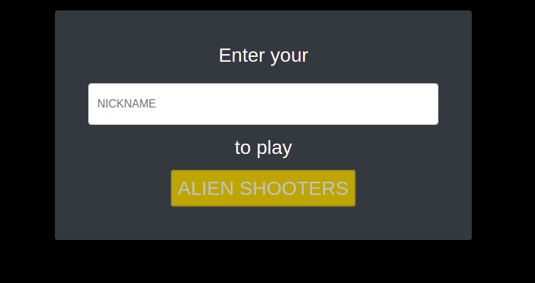
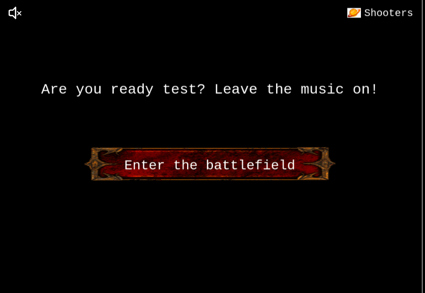
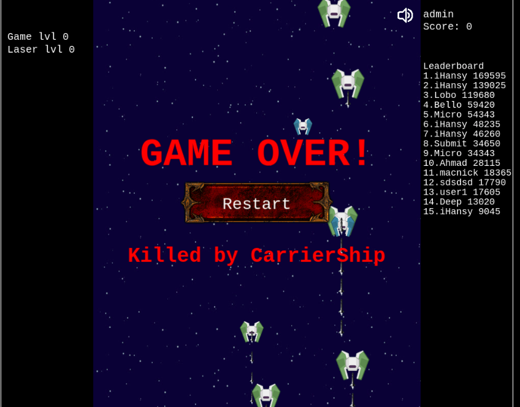

# Alien Shooters - Javascript Phaser 3 Game 
> In this project, we were required to build a space shooter game with the Phaser Javascript library.
>  

> The player will have to kill different types of enemies with AI functionality. He can also pick droppings to increase his weapon level/lives or to enter in shield mode.
>  

> The game currently has 7 levels (from which one is a Boss and the last one has an infinite spawn). The player can reach a maximum of 5 extra lives and level 7 laser.
>  

> The game is tested using Jest for unit testing

## App functionality

- Users are required to choose a nickname when they visit the website
- Users can kill enemies to increase the score and level
- Current game levels by score:
 - Level 0: 0 to 1000 points
 - Level 1: > 1000 points
 - Level 2: > 2500 points
 - Level 3: > 5000 points
 - Level 4: > 7000 points
 - Level 5: > 10000 points
 - Level Boss: > 150000 points
 - Level Infinite: unlock after killing the Boss
- The game has an all time leaderboard, scores are submitted automatically and updated at each game over.
- The leaderboard displays the top 15 perfomers, so to appear ensure you get as many points as you can
- The user can see the leaderboard on the right-side nav.

## Controls

PC: `UP`, `DOWN`, `LEFT` and `RIGHT` arrow keys for movement and `SPACE` for shooting.

## TO PLAY THE GAME ONLINE
 [Live demo](https://mimipeshy.github.io/js-space-shooter/)

## Screenshots of the app.

## Built With

- HTML/SCSS
- Webpack/ES6/Javascript
- Phaser 3
- Node/Express

## Prerequisities

To get this project up and running locally, 
- You must have [node](https://nodejs.org/en/) installed locally. 
- Node will automatically install [npm](https://www.npmjs.com/).

## Getting Started

**To get this project set up on your local machine, follow these simple steps:**

- Navigate through the local folder where you want
- Run git clone `https://github.com/mimipeshy/js-space-shooter.git`
- Run `cd js-space-shooter`
- Next to install packages run `npm i`
- To start the webpack server run `npm run-script dev` to view the app. The server refreshed every time a change to a file is used by it
- Enjoy the app !!!!!

## Tests

1. Open Terminal

2. Install dependencies (only if you did not install them previously):

   `npm install`

3. Run the tests with the command:

   `npm test`

## Retrospective:
After developing the game and looking back at the initial plan, conceived on the second day these are some reflections about my development.

What went wrong? Overall, I assume Phaser would be easier. It's documentation is confusing and not cohesive enough. 

This meant a lot of time was invested in googling how to work around specific things, such as animations and implementing scenes. This was not easy at all and very time consuming. The provided examples and tutorial didn't seem enough.

What went well? Creating the game itself went really well..

## Future improvements
- Make the game playable on mobiles
- Add other worlds/levels/enemies

## Authors

👤 **Peris Ndanu**

- Github: [https://github.com/mimipeshy](https://github.com/mimipeshy)
- Twitter: [https://twitter.com/pygirl54](https://twitter.com/pygirl54)
- Linkedin: [https://www.linkedin.com/in/peris-ndanu/](https://www.linkedin.com/in/peris-ndanu/)

## 🤝 Contributing

Our favourite contributions are those that help us improve the project, whether with a contribution, an issue, or a feature request!

## Show your support

If you've read this far....give us a ⭐️!

## 📝 License

This project is licensed by Microverse and the Odin Project
